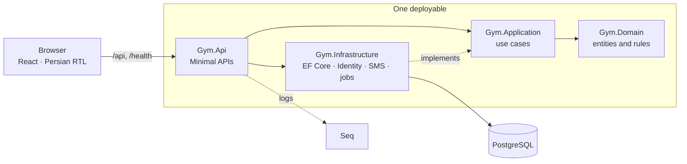

# Gym Management

[](https://github.com/shahramdevops-rgb/Gym-Management/actions/workflows/ci.yml)

Internal management system for a single gym: members, plans, subscriptions, payments,
lockers, attendance, cafe and reporting. Closed system — no public access and no member
logins. The API is .NET 10 / PostgreSQL; the frontend is a Persian, right-to-left React app.

| Document | What it answers |
|---|---|
| [docs/ROADMAP.md](docs/ROADMAP.md) | What is built and what is next |
| [docs/BUSINESS_RULES.md](docs/BUSINESS_RULES.md) | How the gym works — the source of truth for every rule |
| [docs/ARCHITECTURE.md](docs/ARCHITECTURE.md) | Stack, packages, patterns and gotchas |
| [docs/adr/](docs/adr/README.md) | Why the big decisions were made |

## Architecture

A modular monolith with Clean Architecture, organized by feature inside each layer
([ADR 0001](docs/adr/0001-modular-monolith-clean-architecture.md)).



Arrows are project references: Domain references nothing, so business rules are tested
without a database or a web server.

```
src/Gym.Domain/           entities, value objects, Result/Error
src/Gym.Application/      one folder per use case: Command, Validator, Handler, Response
src/Gym.Infrastructure/   EF Core context, migrations, interceptors
src/Gym.Api/              Program.cs, endpoints, error mapping
tests/                    domain unit tests; API integration tests (Testcontainers)
web/                      React frontend
```

## Prerequisites

- .NET SDK 10.0.401 or later (the exact band is pinned in `global.json`)
- Docker Desktop, running
- Node.js 24 (for the frontend in `web/`)

## Local infrastructure

Postgres and Seq run in containers defined by `docker-compose.yml`.

**First time only** — create your local environment file:

```bash
cp .env.example .env
```

Then open `.env` and set `POSTGRES_PASSWORD` to any value you like. `.env` is git-ignored;
`.env.example` is the committed template. Compose refuses to start if a value is missing,
rather than quietly creating a database with an empty password.

**Start and stop:**

```bash
docker compose up -d      # start in the background
docker compose ps         # both services should report (healthy)
docker compose logs -f    # follow the logs
docker compose down       # stop, keeping the data
docker compose down -v    # stop and delete the data volumes
```

`docker compose up -d` returns as soon as the containers are *created*; the health checks
take a few more seconds to report `healthy`. Wait for `docker compose ps` to show both.

| Service | URL | Notes |
|---|---|---|
| Postgres | `localhost:5432` | database and user both `gym` by default |
| Seq (UI) | <http://localhost:8081> | structured logs; wired up in task 0.4 |
| Seq (ingestion) | `http://localhost:5341` | where Serilog will send events |

Ports are configurable in `.env` (`POSTGRES_PORT`, `SEQ_UI_PORT`, `SEQ_INGESTION_PORT`) if
something already listens on them.

### The database password

The password is deliberately split in two so that no credential is ever committed:

| Half | Where it lives | Committed? |
|---|---|---|
| host, port, database, username | `src/Gym.Api/appsettings.Development.json` | yes |
| password | .NET user-secrets, outside the repository | no |

After setting `POSTGRES_PASSWORD` in `.env`, give the API the **same** value:

```bash
dotnet user-secrets set "Postgres:Password" "<the value from .env>" --project src/Gym.Api
```

If you change `POSTGRES_USER` or `POSTGRES_DB` in `.env`, update the connection string in
`appsettings.Development.json` to match — a test fails if the two drift apart. Changing the
user or database name also requires `docker compose down -v`, because Postgres only creates
them when the data volume is empty.

In production nothing here applies: configuration comes from environment variables.

## Database schema

The schema lives in EF Core migrations under `src/Gym.Infrastructure/Persistence/Migrations`.
The `dotnet ef` tool must be installed once and kept at least as new as the EF Core packages:

```bash
dotnet tool install --global dotnet-ef   # or: dotnet tool update --global dotnet-ef
```

```bash
# apply every migration to the local database
dotnet ef database update --project src/Gym.Infrastructure --startup-project src/Gym.Api

# add a migration after changing the model
dotnet ef migrations add <Name> --project src/Gym.Infrastructure --startup-project src/Gym.Api --output-dir Persistence/Migrations
```

Both commands need Postgres running and the `Postgres:Password` user-secret set. They pick up
`Development` configuration from `src/Gym.Api/Properties/launchSettings.json`, which is why
they can see `appsettings.Development.json` and user-secrets at all.

Migrations are never applied automatically at startup in production; task 6.2 runs a migration
bundle during deployment instead.

## Build and test

```bash
dotnet build                          # solution; warnings are errors
dotnet test                           # all tests
dotnet test tests/Gym.Domain.Tests    # domain tests only
dotnet run --project src/Gym.Api      # run the API
```

Integration tests start their own Postgres container through Testcontainers, so Docker must
be running for `dotnet test` (from task 0.6 on).

## Running the API

```bash
dotnet run --project src/Gym.Api      # http://localhost:5134
```

| Endpoint | What it is |
|---|---|
| <http://localhost:5134/health> | `Healthy` only when the database is reachable too — stop Postgres and it returns `503 Unhealthy` |
| <http://localhost:5134/scalar/v1> | API explorer (Development only) |
| <http://localhost:5134/openapi/v1.json> | the OpenAPI document the explorer renders, and the input to `npm run gen:api` |
| <http://localhost:8081> | Seq — structured logs from the running API |

Every response carries an `X-Correlation-Id` header holding the request's W3C trace id. The
same value is attached to every log event as `CorrelationId`, so pasting it into Seq's filter
box shows everything that one request did:

```
CorrelationId = 'cc8367be7ab726497ac6a73977b0aac5'
```

If the frontend sends a `traceparent` header, its trace id is reused rather than replaced, so
one id covers both sides of the call.

### Log levels

Levels live in `appsettings.json` (`Serilog` section), not in code, so they can be changed
without a rebuild. Development adds the Seq sink and turns on EF Core's SQL logging.
`/health` is logged at `Debug` on purpose — a probe polled every ten seconds is 8,640 events a
day that say nothing, and Seq stays readable without it.

## Frontend

The frontend lives in `web/`: Vite, React, TypeScript, Tailwind CSS and shadcn/ui. The UI is
Persian and right-to-left; dates are shown in the Jalali calendar.

```bash
cd web
npm ci                # first time, and after package-lock.json changes
npm run dev           # http://localhost:5173
npm run lint          # ESLint, including a rule that rejects physical left/right classes
npm test              # Vitest
npm run build         # type-check and production build
npm run format        # Prettier
```

`npm run dev` proxies `/api` and `/health` to the API on `http://localhost:5134`, so run the
API alongside it. The browser only ever talks to one origin, as it will in production.

### API types

`web/src/lib/api/schema.d.ts` is generated from the API's OpenAPI document and committed. After
changing any endpoint, with the API running:

```bash
cd web
npm run gen:api
```

A mismatch between the frontend and the API then shows up as a type error in `npm run build`.

## Continuous integration

[`.github/workflows/ci.yml`](.github/workflows/ci.yml) runs on every push to `main` and to
`task/**` branches, and on pull requests:

| Job | Steps |
|---|---|
| Backend | `dotnet restore`, `build` (Release, warnings are errors), `test` — integration tests start Postgres through Testcontainers on the runner's Docker |
| Frontend | `npm ci`, `lint`, `format:check`, `test`, `build` |

## Deployment

One Docker Compose stack (API, Postgres, Caddy) on a single rented Iranian VPS, reachable over a
real domain with an automatically issued certificate, with images built here and transferred
rather than built on the server. The reasoning, the alternatives and what the choice costs are in
[ADR 0003](docs/adr/0003-deployment-topology.md).

**Preparing a server** — everything from a bare VPS to a host that can take a release: user and
SSH key, firewall, `fail2ban`, swap, clock, Docker, DNS, `/opt/gym/.env` — is in
[docs/SERVER-SETUP.md](docs/SERVER-SETUP.md), with the reason for each step. Run it once per
server, and again if one is ever rebuilt.

**Releasing** to a prepared server is one command from the development machine:

```bash
deploy/release.sh gym@<server-ip> --with-postgres    # --with-postgres on the first release only
```

It builds the images here, builds the EF migration bundle, copies everything over, runs the
migrations and starts the new version. `./server.sh rollback` on the server goes back.

Still to do is go-live (task 6.4 of the [roadmap](docs/ROADMAP.md)): the first real deploy, the
certificate, and the Persian smoke test.

## Backup and restore

Two copies, no cloud (ADR 0003). Every night the server dumps the database to
`/opt/gym/backups` (`gym-YYYYmmdd-HHMMSS.dump`, the newest 120 kept, about four months). The gym's Windows computer
then **pulls** the newest dump onto its own disk and onto a flash drive (the newest 30 kept).
The dumps contain members' names and phone numbers: keep the flash drive somewhere safe, and
consider BitLocker To Go on it.

The database dump does not contain `/opt/gym/.env` (database password, token signing key). The
Owner keeps one copy of that file, **not** on the flash drive with the dumps.

### One-time setup on the server

Both scripts arrive with every release (`deploy/release.sh` copies them to `/opt/gym`).

```bash
# 1. Nightly dump at 03:00 Tehran time, as the user that owns /opt/gym.
crontab -e
#   CRON_TZ=Asia/Tehran
#   0 3 * * * cd /opt/gym && ./backup.sh run >> /opt/gym/backups/backup.log 2>&1

# 2. A read-only account for the gym's computer. It is not in the docker group and cannot read .env.
sudo adduser --disabled-password --gecos "" gymbackup
sudo install -d -m 700 -o gymbackup -g gymbackup /home/gymbackup/.ssh
echo 'restrict <the public key from the gym computer>' | sudo tee /home/gymbackup/.ssh/authorized_keys
sudo chown gymbackup:gymbackup /home/gymbackup/.ssh/authorized_keys
sudo chmod 600 /home/gymbackup/.ssh/authorized_keys
sudo chmod o+x /opt/gym          # lets it reach backups/ only; .env stays mode 600

# 3. /opt/gym and .env must belong to the user you deploy as (the one deploy/release.sh ssh's
#    in as). Compose reads .env as that user, and a release rewrites its TAG line.
sudo chown -R "$USER" /opt/gym && chmod 600 /opt/gym/.env
./backup.sh run                  # the first dump also fixes the group of backups/
```

### One-time setup on the gym's computer (Windows)

```powershell
# Copy deploy\pull-backup.ps1 to C:\GymBackup\, then:
ssh-keygen -t ed25519 -N '""' -f C:\GymBackup\id_ed25519      # press Enter; no passphrase, it runs unattended
icacls C:\GymBackup\id_ed25519 /inheritance:r /grant:r "$($env:USERNAME):R"   # ssh refuses a key others can read
# Put the contents of id_ed25519.pub in the server's authorized_keys (above), then accept the
# server's host key once, by hand:
ssh -i C:\GymBackup\id_ed25519 gymbackup@gym.example.ir exit

$arguments = '-NoProfile -ExecutionPolicy Bypass -File C:\GymBackup\pull-backup.ps1 ' +
  '-RemoteHost gymbackup@gym.example.ir -KeyFile C:\GymBackup\id_ed25519 ' +
  '-LocalDir C:\GymBackups -FlashDir E:\GymBackups'
$action   = New-ScheduledTaskAction -Execute 'powershell.exe' -Argument $arguments
# This computer may be switched off at night, so it also runs at every log-on, and a missed run starts when it can.
$triggers = @((New-ScheduledTaskTrigger -Daily -At 4:30am), (New-ScheduledTaskTrigger -AtLogOn))
$settings = New-ScheduledTaskSettingsSet -StartWhenAvailable -RunOnlyIfNetworkAvailable
Register-ScheduledTask -TaskName 'Gym backup pull' -Action $action -Trigger $triggers -Settings $settings
Start-ScheduledTask -TaskName 'Gym backup pull'               # try it now
```

Read the result in Task Scheduler ("Last Run Result") or in `C:\GymBackups\pull-backup.log`:
`0` fine, `1` failed or the server's newest backup is over 36 hours old (the nightly job has
stopped), `2` saved on the computer but the flash drive was not attached.

### Restore

Do this once, before you need it. A dump is only a backup if it has been restored.

```bash
# On the server, with the dump copied next to the scripts (scp it from the gym computer if needed):

# A. Check a dump in a scratch database. The live database is not touched.
./backup.sh restore-scratch gym-20260924-030001.dump      # prints the rows per table

# B. Replace the live database with a dump (the app is stopped while it runs).
./backup.sh restore gym-20260924-030001.dump --yes
```

`restore` first saves the current database as `backups/pre-restore-*.dump`, stops the API and
Caddy, recreates the database from the dump, applies any migrations the dump does not have
(`efbundle`), and starts everything again. Users, members, payments and the audit log all come
back as they were in the dump; anything after the dump's time is lost.

If the whole server is lost: provision a new one (task 6.0), put `.env` back, run
`deploy/release.sh <user@host> --with-postgres` from the development machine, then restore the
newest dump as in B.
